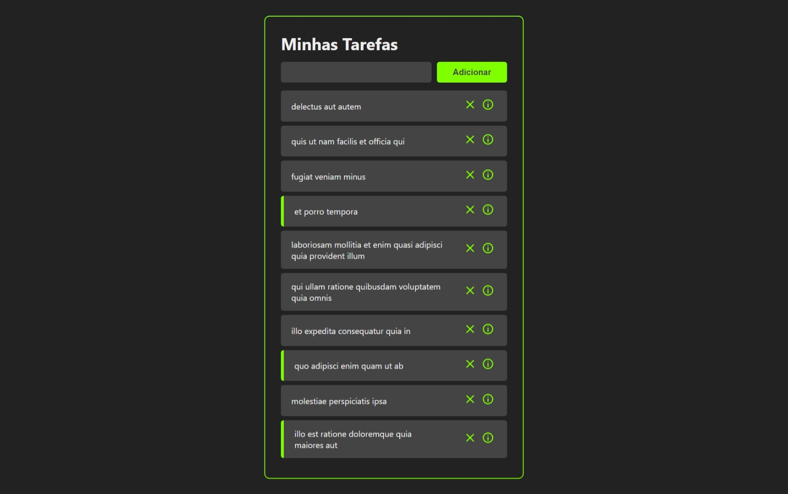
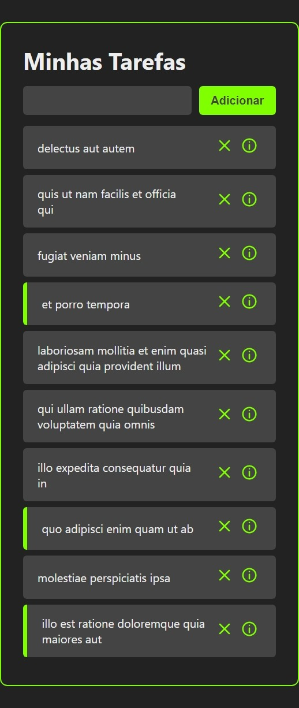

# task-list

Este é um projeto feito para estudos e aprimoramento dos conhecimentos em React.
É basicamente uma lista de tarefas, a qual se consegue adicionar novas tarefas, marcar como feito e visualizar sua descrição.

## Índice

- [Visão geral](#visão-geral)
  - [Screenshot](#screenshot)
  - [Links](#links)
- [Meu processo](#meu-processo)
  - [Feito com](#feito-com)
  - [O que aprendi](#o-que-aprendi)
  - [Desenvolvimento contínuo](#Desenvolvimento-contínuo)
- [Autor](#autor)

## Visão geral

### Screenshot

### Links

- Visualização do site: [Visualizar](https://my-task-list-xi.vercel.app/)

## Meu processo

### Feito com

- ReactJs
- JavaScript
- HTML
- CSS

### O que aprendi

Aprendi mais sobre o React me desafiando a criar esta lista de tarefas. Aprendi muito mais sobre códigos em React e a facilidade de se trabalhar com componentes. Aprendi a utilizar mais comandos e funcionalidades do "npm", conceitos e funcionalidades como o "react-router-dom", "useState" e "useEffect", o que tornou a criação do projeto muito mais fácil, rápida e intuitiva.

###  Desenvolvimento contínuo

Continuarei estudando o React, biblioteca a qual estou adorando utilizar por conta da facilidade e praticidade. Os próximos passos são me aprofundar cada vez mais em funções de javaScript, aprender mais sobre o conceito de API's, React Hooks e Routes.

## Autor

- Portifólio - [Portifólio - Guilherme Novaes](https://guilherme-novaes-portifolio.vercel.app/)
- LinkedIn - [Guilherme Rogério Novaes](https://www.linkedin.com/in/guilherme-r-novaes/)
- GitHub - [Guilherme-RNovaes](https://github.com/Guilherme-RNovaes)